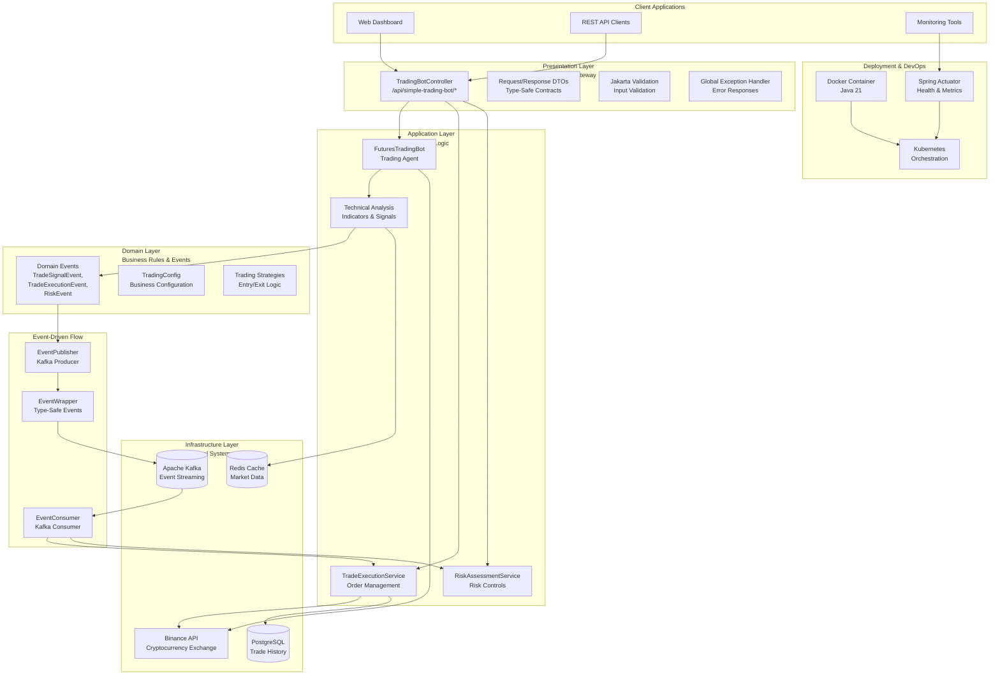

# Simple-trading-bot

A Spring Boot-based automated trading bot for long and short positions in cryptocurrency futures markets (e.g., BTC/USDT on Binance Futures) with configurable leverage, trailing stop-loss, optional sentiment analysis from X posts, and support for paper trading. Uses Redis caching to optimize performance. Built for extensibility and testability.

## 🏗️ Architecture Overview

This trading bot follows a **layered, event-driven architecture** built with Domain-Driven Design (DDD) principles and Spring Boot best practices.

### High-Level Architecture



### Architecture Layers

#### 🎨 **Presentation Layer**
- **REST API Controllers**: `TradingBotController` with method-specific DTOs
- **Request/Response DTOs**: Type-safe contracts with Jakarta validation
- **Global Exception Handling**: Spring `@ControllerAdvice` for consistent error responses
- **OpenAPI Documentation**: Auto-generated Swagger docs

#### 🚀 **Application Layer**
- **Trading Agents**: `FuturesTradingBot` implementing `TradingAgent` interface
- **Business Services**: Trade execution, risk assessment, technical analysis
- **Exchange Integration**: Live trading (Binance) and paper trading modes
- **Strategy Components**: Indicators, sentiment analysis, trailing stops

#### 🎯 **Domain Layer**
- **Domain Events**: `TradeSignalEvent`, `TradeExecutionEvent`, `RiskEvent`, etc.
- **Business Rules**: Trading configurations, risk parameters, strategies
- **Value Objects**: `TradeDirection`, immutable business data
- **Domain Services**: Pure business logic without external dependencies

#### 🔧 **Infrastructure Layer**
- **Event Streaming**: Apache Kafka with type-safe `EventWrapper`
- **Caching**: Redis for market data and technical indicators
- **External APIs**: Binance Futures API with rate limiting and circuit breakers
- **Persistence**: PostgreSQL for trade history and audit trails

### Key Architectural Patterns

#### 🏛️ **Domain-Driven Design (DDD)**
- **Clear separation** between transport (DTOs) and domain objects
- **Ubiquitous language** in domain events and business rules
- **Bounded contexts** for trading, risk management, and execution

#### 📡 **Event-Driven Architecture**
- **Asynchronous processing** with Kafka event streaming
- **Type-safe events** using `EventWrapper<T extends TradingEvent>`
- **Event sourcing** capabilities for audit trails
- **CQRS-ready** architecture for complex queries

#### 🛡️ **Resilience Patterns**
- **Circuit Breaker**: Resilience4j for external API failures
- **Rate Limiting**: API quota management for exchanges
- **Retry Logic**: Exponential backoff for transient failures
- **Fallback Strategies**: Paper trading as circuit breaker fallback

#### 📊 **Observability**
- **Spring Actuator**: Health checks, metrics, and monitoring
- **Custom Metrics**: Trading performance and system health
- **Structured Logging**: Event correlation and debugging
- **Event Tracing**: Complete audit trail with `EventWrapper` metadata

## Features

- Agent-based architecture: Each trading bot is an agent, managed by an AgentManager for multi-bot deployments.
- Executes long and short positions using technical indicators (RSI, MACD, Bollinger Bands) on daily ("1d") and weekly ("1w") timeframes.
- Paper trading mode: Simulate trades and margin using in-memory logic for safe testing and strategy development.
- Extensible indicator architecture: Easily add new technical indicators via configuration or code.
- Improved testability: All dependencies are injected for easy mocking and unit testing.
- Configurable leverage (default 3x), adjustable via REST API.
- Trailing stop-loss (1%) to maximize profits during uptrends.
- Optional sentiment analysis from X posts for entry decisions.
- RESTful APIs for starting, stopping, configuring, and monitoring the bot.
- Redis caching with hybrid TTL and event-based invalidation for performance.
- Support for Binance Futures, configurable via system property.
- Built with SOLID and Clean Code principles for maintainability.
- AWS-ready: Dockerfile and ECS task definition provided for cloud deployment.

### Prerequisites

* Java 17  
* Gradle 8.5+ (or use included wrapper)  
* Binance Futures account with API key/secret (trading permissions only)    
* X API access for sentiment analysis (optional)    
* Redis server (e.g., localhost:6379)   
* Docker and Docker Compose for containerization


### Agent Architecture

The bot is now refactored as an agent implementing the `TradingAgent` interface. Multiple agents can be managed and deployed using the `AgentManager` class. This enables scalable, multi-symbol, or multi-exchange deployments.

### Setup

1. Clone the repository:
    ```bash
    git clone <repository-url>
    cd simple-trading-bot
    ```


2. Configure application.properties with Redis settings and X API credentials (if using sentiment analysis).
3. Update API keys in TradingBotApplication.java (replace placeholders like "YOUR_BINANCE_API_KEY").
4. Set exchange (Binance by default):
    ```bash
    java -Dexchange=binance -jar simple-trading-bot-1.0-SNAPSHOT.jar
    ```
    
5. Build and run:
    ```bash
    ./gradlew build
    ./gradlew bootRun
    ```

   Or if you prefer the full Gradle installation:
    ```bash
    gradle build
    gradle bootRun
    ```


#### AWS & Docker Setup

Build the Docker image:    
   ```bash
   docker build -t simple-trading-bot .
   ```


Run with Docker (standalone, without Redis):
  ```bash
    docker run -p 8080:8080 --name simple-trading-bot simple-trading-bot
  ``` 


Note: This requires a separate Redis instance. Use -e SPRING_DATA_REDIS_HOST=host.docker.internal if Redis is on host.

##### AWS ECS Deployment

1. Build and push your Docker image to AWS ECR.
2. Use the provided `aws-ecs-task-definition.json` to deploy on ECS Fargate.
3. Configure environment variables for secrets and config in ECS.
4. Logging is compatible with AWS CloudWatch.


Run with Docker Compose (includes Redis):
  ```bash
    docker-compose up --build
  ```


This starts the tradingbot and Redis services.      
Access the bot at http://localhost:8080.   
Set exchange with -e exchange=binance in docker-compose.yml or environment.

#### Kubernetes Setup

Apply Kubernetes manifests:
```bash
    kubectl apply -f redis-deployment.yaml
    kubectl apply -f redis-service.yaml
    kubectl apply -f deployment.yaml
    kubectl apply -f service.yaml 
```


Access the service (use LoadBalancer or port-forward for minikube):     

```bash
    kubectl port-forward service/simple-trading-bot 8080:8080.    
```      

Access at http://localhost:8080.  


### Usage

Start Bot (Long/Short, Live/Paper):
```http
POST /api/simple-trading-bot/start?direction=LONG&paper=true
POST /api/simple-trading-bot/start?direction=SHORT&paper=false
```

Stop Bot:
```http
POST /api/simple-trading-bot/stop
```

Get Status:
```http
GET /api/simple-trading-bot/status
```

Update Config:
```http
POST /api/simple-trading-bot/configure
Body: {"symbol":"BTCUSDT","tradeAmount":0.001,...}
```

Set Leverage:
```http
POST /api/simple-trading-bot/leverage?leverage=5
```

Enable/Disable Sentiment:
```http
POST /api/simple-trading-bot/sentiment?enable=true
```

### Testing
  Run unit tests:
  ```bash
      ./gradlew test
   ```

   For continuous testing:
   ```bash
      ./gradlew test --continuous
   ```

### Redis Setup

1. Install Redis (e.g., sudo apt install redis-server on Ubuntu).    
2. Start Redis: redis-server.    
3. Configure spring.data.redis.host and port in application.properties.


### Paper Trading

To safely test strategies, start the bot in paper mode (`paper=true`). All trades and margin are simulated in memory. No real funds are used or at risk.

### Extending Indicators

Add new technical indicators by implementing the `TechnicalIndicator` interface and registering them in the `IndicatorCalculator` via code or configuration. The bot will automatically compute and use all registered indicators.

### Testability

All dependencies are injected via constructors, making it easy to mock services and indicators for unit testing.

---

Disclaimer    
This is for educational purposes only. Leveraged trading is risky and may result in total loss of capital.    
Test on Binance Futures Testnet. Not financial advice.   

Documentation    
See docs/LongTradingBotPRD.md for detailed requirements and agent architecture.
