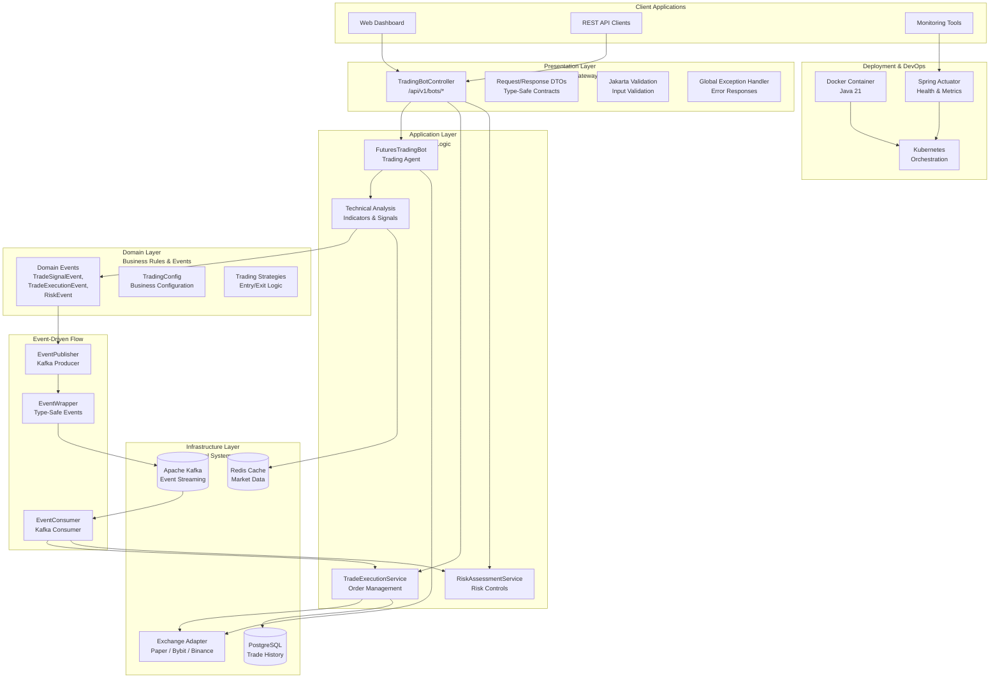

# Agentic AI Trading Bot

A Spring Boot-based automated trading bot that combines **Agentic AI (LLMs)** with traditional quantitative strategies for cryptocurrency futures markets.

**Safe defaults are enabled out of the box**: the backend listens on **8081**, the default exchange provider is **paper**, autonomous order placement stays in **dry-run**, and **mainnet trading is disabled** until explicitly enabled.

## 🚀 Key Features

### 🧠 Agentic AI Core
- **Autonomous Agents**: Uses **Grok (X.AI)** or OpenAI for market reasoning and decision making.
- **RAG Architecture**: Retrieves market context and historical patterns using **Pinecone** vector database.
- **Sentiment Analysis**: Analyzes market sentiment (currently simulated/placeholder).
- **Natural Language Orders**: Parses trading instructions directly from LLM reasoning (e.g., "Buy 0.5 BTC with 5x leverage").

### 📉 Trading Capabilities
- **Multi-Exchange Support**:
  - **Bybit Futures** (✅ **Recommended for Testing**): Full V5 API support, Real Execution, Testnet Ready.
  - **Binance Futures**: Mainnet support (Production only).
  - **dYdX v4**: Market data enabled, Trade execution is mocked/simulated (Safe for testing navigation).
  - **Paper Trading**: Fully simulated local execution for strategy development.
- **Advanced Exit Strategies**:
  - Trailing Stop-Loss
  - Liquidation Risk Guard
  - MACD Reversal Exit
  - RSI Overbought/Oversold Exit

### 🛠 Technical Architecture
- **Tech Stack**: Java 21, Spring Boot 3.2
- **Event-Driven**: Apache Kafka for asynchronous event processing.
- **Data & Caching**: PostgreSQL for persistence, Redis for high-performance caching.
- **Resilience**: Circuit Breakers & Rate Limiters (Resilience4j) for all exchange interactions.

---

## 🚦 Project Status

| Component | Status | Notes |
|-----------|--------|-------|
| **Bybit Integration** | 🟢 **Ready** | Fully functional. Supports Mainnet & Testnet V5 API. |
| **Binance Integration** | 🟡 **Mainnet Only** | Functional logic, but hardcoded to Mainnet URLs. |
| **dYdX Integration** | 🟠 **Partial** | Reads market data/balance. Trade execution is **Mocked** (no gas signing). |
| **AI / RAG Agents** | 🟢 **Beta** | RAG pipeline and Grok integration implemented. |
| **Sentiment Analysis** | 🔴 **Mocked** | Placeholder logic. Needs real API credentials. |

---

## ⚡ Quick Start (Safe Local Mode)

The default runtime is intentionally conservative:

- `server.port=8081`
- `trading.execution.mode=paper`
- `trading.exchange.provider=paper`
- `rag.order.dry-run=true`
- `trading.live.enabled=false`

### 1. Prerequisites
- Java 21 LTS
- Docker & Docker Compose (for Kafka, Redis, Postgres)

### 2. Configuration
Copy `.env.example` to `.env` (or export the same environment variables in your shell):

```properties
SERVER_PORT=8081
TRADING_EXECUTION_MODE=paper
TRADING_EXCHANGE_PROVIDER=paper
TRADING_LIVE_ENABLED=false
TRADING_BYBIT_DOMAIN=TESTNET_DOMAIN
```

### 3. Run Dependencies
```bash
docker-compose up -d
```

### 4. Start the Bot
```bash
./gradlew bootRun
```

### 5. Access the Backend

- OpenAPI / Swagger UI: `http://localhost:8081/swagger-ui.html`
- Backend bot API base path: `/api/v1/bots`
- Gateway-style routes are also available under `/gateway/api/bots/**`

### Bybit Testnet Execution (Explicit, Non-Mainnet)

To execute against **Bybit Testnet** instead of paper mode, switch the execution mode and provider explicitly:

```properties
SPRING_PROFILES_ACTIVE=live
TRADING_EXECUTION_MODE=live
TRADING_EXCHANGE_PROVIDER=bybit
TRADING_BYBIT_DOMAIN=TESTNET_DOMAIN
TRADING_BYBIT_API_KEY=YOUR_TESTNET_KEY
TRADING_BYBIT_API_SECRET=YOUR_TESTNET_SECRET
```

### Mainnet Execution (Explicit Opt-In Only)

Mainnet execution requires **all** of the following:

```properties
SPRING_PROFILES_ACTIVE=prod,live
TRADING_EXECUTION_MODE=live
TRADING_EXCHANGE_PROVIDER=binance   # or bybit
TRADING_BYBIT_DOMAIN=MAINNET_DOMAIN # only when provider=bybit
TRADING_LIVE_ENABLED=true
TRADING_BINANCE_API_KEY=...
TRADING_BINANCE_API_SECRET=...
```

If `TRADING_LIVE_ENABLED=true` is not set, mainnet providers are rejected during startup.

---

## 🧪 Testing

### API Tests
The `api-tests/` directory contains HTTP scripts for direct testing.

- **Gateway Tests**: `api-tests/gateway-api-tests.http`
- **Agent Tests**: `api-tests/agent-api-tests.http`

### Unit & Integration Tests
```bash
./gradlew test
```

---

## 📚 Documentation

For detailed implementation guides:
- [Agentic AI Implementation](AGENTIC_AI_IMPLEMENTATION_SUMMARY.md) - Deep dive into the LLM/RAG system.
- [Binance Integration](BINANCE_API_INTEGRATION.md)
- [Architecture Diagram](AGENTIC_AI_IMPLEMENTATION_SUMMARY.md#architecture)

## 🏗️ Architecture Overview

This trading bot follows a **layered, event-driven architecture** built with Domain-Driven Design (DDD) principles and Spring Boot best practices.

### High-Level Architecture


```mermaid
graph TB
    %% Client Layer
    subgraph "Client Applications"
        WEB[Web Dashboard]
        API[REST API Clients]
        MONITOR[Monitoring Tools]
    end

    %% Presentation Layer
    subgraph "Presentation Layer<br/>REST API Gateway"
        CONTROLLER[TradingBotController<br/>/api/v1/bots/*]
        DTO[Request/Response DTOs<br/>Type-Safe Contracts]
        VALIDATION[Jakarta Validation<br/>Input Validation]
        EXCEPTIONS[Global Exception Handler<br/>Error Responses]
    end

    %% Application Layer
    subgraph "Application Layer<br/>Business Logic"
        BOT[FuturesTradingBot<br/>Trading Agent]
        EXECUTION[TradeExecutionService<br/>Order Management]
        RISK[RiskAssessmentService<br/>Risk Controls]
        ANALYSIS[Technical Analysis<br/>Indicators & Signals]
    end

    %% Domain Layer
    subgraph "Domain Layer<br/>Business Rules & Events"
        EVENTS[Domain Events<br/>TradeSignalEvent,<br/>TradeExecutionEvent,<br/>RiskEvent]
        CONFIG[TradingConfig<br/>Business Configuration]
        STRATEGY[Trading Strategies<br/>Entry/Exit Logic]
    end

    %% Infrastructure Layer
    subgraph "Infrastructure Layer<br/>External Systems"
        KAFKA[(Apache Kafka<br/>Event Streaming)]
        REDIS[(Redis Cache<br/>Market Data)]
        EXCHANGE[Exchange Adapter<br/>Paper / Bybit / Binance]
        DATABASE[(PostgreSQL<br/>Trade History)]
    end

    %% Event Flow
    subgraph "Event-Driven Flow"
        PUBLISHER[EventPublisher<br/>Kafka Producer]
        CONSUMER[EventConsumer<br/>Kafka Consumer]
        WRAPPER[EventWrapper<br/>Type-Safe Events]
    end

    %% Deployment
    subgraph "Deployment & DevOps"
        DOCKER[Docker Container<br/>Java 21]
        KUBERNETES[Kubernetes<br/>Orchestration]
        MONITORING[Spring Actuator<br/>Health & Metrics]
    end

    %% Connections
    WEB --> CONTROLLER
    API --> CONTROLLER
    MONITOR --> MONITORING

    CONTROLLER --> BOT
    CONTROLLER --> EXECUTION
    CONTROLLER --> RISK

    BOT --> ANALYSIS
    ANALYSIS --> EVENTS

    EVENTS --> PUBLISHER
    PUBLISHER --> WRAPPER
    WRAPPER --> KAFKA

    KAFKA --> CONSUMER
    CONSUMER --> EXECUTION
    CONSUMER --> RISK

    BOT --> EXCHANGE
    EXECUTION --> EXCHANGE
    ANALYSIS --> REDIS

    EXECUTION --> DATABASE

    DOCKER --> KUBERNETES
    MONITORING --> KUBERNETES
```

### Architecture Layers

#### 🎨 **Presentation Layer**
- **REST API Controllers**: `TradingBotController` with method-specific DTOs
- **Request/Response DTOs**: Type-safe contracts with Jakarta validation
- **Global Exception Handling**: Spring `@ControllerAdvice` for consistent error responses
- **OpenAPI Documentation**: Auto-generated Swagger docs

#### 🚀 **Application Layer**
- **Trading Agents**: `FuturesTradingBot` implementing `TradingAgent` interface
- **Business Services**: Trade execution, risk assessment, technical analysis
- **Exchange Integration**: Paper-first defaults with explicit Bybit / Binance opt-in
- **Strategy Components**: Indicators, sentiment analysis, trailing stops

#### 🎯 **Domain Layer**
- **Domain Events**: `TradeSignalEvent`, `TradeExecutionEvent`, `RiskEvent`, etc.
- **Business Rules**: Trading configurations, risk parameters, strategies
- **Value Objects**: `TradeDirection`, immutable business data
- **Domain Services**: Pure business logic without external dependencies

#### 🔧 **Infrastructure Layer**
- **Event Streaming**: Apache Kafka with type-safe `EventWrapper`
- **Caching**: Redis for market data and technical indicators
- **External APIs**: Multi-exchange adapters with rate limiting and circuit breakers
- **Persistence**: PostgreSQL for trade history and audit trails

### Key Architectural Patterns

#### 🏛️ **Domain-Driven Design (DDD)**
- **Clear separation** between transport (DTOs) and domain objects
- **Ubiquitous language** in domain events and business rules
- **Bounded contexts** for trading, risk management, and execution

#### 📡 **Event-Driven Architecture**
- **Asynchronous processing** with Kafka event streaming
- **Type-safe events** using `EventWrapper<T extends TradingEvent>`
- **Event sourcing** capabilities for audit trails

#### 🛡️ **Resilience Patterns**
- **Circuit Breaker**: Resilience4j for external API failures
- **Rate Limiting**: API quota management for exchanges
- **Retry Logic**: Exponential backoff for transient failures
- **Fallback Strategies**: Paper trading as circuit breaker fallback

## 🛠 Deployment

### Docker Support
The application is fully containerized.

1. **Build Image**:
   ```bash
   docker build -t simple-trading-bot .
   ```

2. **Run with Dependencies**:
   ```bash
   docker-compose up -d
   ```

### AWS Deployment
- **ECS**: Use `aws-ecs-task-definition.json` for Fargate deployment.
- **Logging**: Configured for CloudWatch compatibility.
- **Config**: Use AWS Parameter Store or Secrets Manager for API keys.

## 📝 Configuration Reference

| Property | Default | Description |
|----------|---------|-------------|
| `server.port` | `8081` | Backend HTTP port |
| `trading.execution.mode` | `paper` | Execution gateway mode (`paper`, `live`) |
| `trading.exchange.provider` | `paper` | Exchange adapter (`paper`, `bybit`, `binance`) |
| `trading.bybit.domain` | `TESTNET_DOMAIN` | Bybit environment (`TESTNET_DOMAIN`, `MAINNET_DOMAIN`) |
| `trading.live.enabled` | `false` | Required before any mainnet exchange access is allowed |
| `rag.order.dry-run` | `true` | Logs AI-generated orders without sending them to an exchange |
| `rag.order.max-position-size-percent` | `10` | Hard cap for LLM-driven position size as % of account balance |
| `rag.order.default-leverage` | `1` | Safe default leverage for automated order placement |
| `rag.enabled` | `true` | Enable Agentic AI features |
| `rag.embedding.provider` | `openai` | Embedding provider (`openai`, `grok`, `local`) |

## 🛡 Hard Risk Limits & Restart Behavior

Current hard safety controls that are enabled in code:

- **Paper-first default**: new bots are created in paper mode unless explicitly started otherwise.
- **Dry-run AI execution**: `rag.order.dry-run=true` by default.
- **Position-size cap**: `rag.order.max-position-size-percent=10` limits LLM-driven orders to 10% of balance.
- **Default leverage**: `rag.order.default-leverage=1`.
- **Live gateway guardrails**: the live execution gateway enforces a minimum margin balance and automatically places bracket exits (2% stop-loss / 5% take-profit defaults).
- **Mainnet lock**: mainnet providers are blocked unless `trading.live.enabled=true` is explicitly set.

Restart behavior today:

- Bot definitions are persisted and reloaded from the database on startup.
- Bots previously marked `RUNNING` are restarted automatically by `AgentManager`.
- **Important:** exchange-side position reconciliation is still manual/partial. After any unclean shutdown, verify open exchange positions before re-enabling non-paper execution.

## 🤝 Contributing

1. Fork the repository
2. Create your feature branch (`git checkout -b feature/amazing-feature`)
3. Commit your changes (`git commit -m 'Add some amazing feature'`)
4. Push to the branch (`git push origin feature/amazing-feature`)
5. Open a Pull Request

## 🛠 Deployment

### Docker Support

The bundled `docker-compose.yml` starts the backend with safe defaults and exposes the backend on `http://localhost:8081`.

```bash
docker-compose up -d
```

### Kubernetes Setup

Apply the included manifests:

```bash
kubectl apply -f redis-deployment.yaml
kubectl apply -f redis-service.yaml
kubectl apply -f deployment.yaml
kubectl apply -f service.yaml
```

Port-forward the backend service:

```bash
kubectl port-forward service/simple-trading-bot 8081:8081
```

### AWS Deployment

- **ECS**: use `aws-ecs-task-definition.json`.
- **Config**: provide secrets via AWS Secrets Manager / Parameter Store.
- **Default**: the task definition now starts in paper mode; mainnet settings must be supplied explicitly.

## ▶️ Usage

Create a bot:

```http
POST /api/v1/bots
```

Start a bot in the safe default mode:

```http
POST /api/v1/bots/{botId}/start
Content-Type: application/json

{
    "direction": "LONG",
    "paper": true
}
```

Start a bot against an external exchange (only after explicit opt-in):

```http
POST /api/v1/bots/{botId}/start
Content-Type: application/json

{
    "direction": "LONG",
    "paper": false
}
```

Other common endpoints:

```http
PUT  /api/v1/bots/{botId}/stop
GET  /api/v1/bots/{botId}/status
POST /api/v1/bots/{botId}/configure
POST /api/v1/bots/{botId}/leverage
POST /api/v1/bots/{botId}/sentiment
GET  /api/v1/bots
DELETE /api/v1/bots/{botId}
```

## 🧪 Testing

Run backend tests:

```bash
./gradlew test
```

Run gateway tests:

```bash
./gradlew -p gateway test
```

For direct HTTP coverage, use the scripts in `api-tests/`.

## 🧾 Paper Trading

Paper mode simulates fills, margin, and position changes entirely in memory. It is the default and should remain your first stop for strategy validation.

## 🔌 Extending Indicators

Add new technical indicators by implementing the `TechnicalIndicator` interface and registering them in `IndicatorCalculator`.

## 🧪 Testability

Dependencies are constructor-injected, which keeps unit testing and service mocking straightforward.

---

## Disclaimer

This project is for educational purposes only. Leveraged trading can result in total loss of capital. Validate strategies in paper mode or exchange testnet environments before considering any live deployment.

## Additional Documentation

See `docs/FuturesTradingBotPRD.md` for the requirements baseline and agent architecture details.
