# Simple Trading Bot - Architecture Document

## Table of Contents
1. [System Overview](#system-overview)
2. [Architecture Principles](#architecture-principles)
3. [High-Level Design](#high-level-design)
4. [System Architecture](#system-architecture)
5. [Component Diagram](#component-diagram)
6. [Package Structure](#package-structure)
6. [Core Components](#core-components)
7. [Data Flow](#data-flow)
8. [Technology Stack](#technology-stack)
9. [Design Patterns](#design-patterns)
10. [Security Architecture](#security-architecture)
11. [Performance & Scalability](#performance--scalability)
12. [Testing Strategy](#testing-strategy)V
13. [Deployment Architecture](#deployment-architecture)
14. [Future Considerations](#future-considerations)

## System Overview

The Simple Trading Bot is a Spring Boot-based automated cryptocurrency futures trading system designed with enterprise-grade architecture principles. The system implements an agent-based pattern where individual trading bots operate as autonomous agents managed by a centralized agent manager. 

### Key Architectural Goals
- **Modularity**: Clean separation of concerns with well-defined interfaces
- **Extensibility**: Easy to add new trading strategies, indicators, and exchanges
- **Testability**: Comprehensive mocking support and isolated testing
- **Scalability**: Support for multiple trading agents and horizontal scaling
- **Resilience**: Built-in circuit breakers, rate limiting, and retry mechanisms
- **Observability**: Comprehensive logging, monitoring, and API documentation

## Architecture Principles

### 1. **Clean Architecture**
- Domain-driven design with clear business logic separation
- Dependency inversion with interfaces and dependency injection
- Layered architecture with distinct responsibilities

### 2. **SOLID Principles**
- **S**ingle Responsibility: Each class has one reason to change
- **O**pen/Closed: Open for extension, closed for modification
- **L**iskov Substitution: Interfaces are properly substitutable
- **I**nterface Segregation: Focused, role-based interfaces
- **D**ependency Inversion: Depend on abstractions, not concretions

### 3. **Microservices Ready**
- RESTful APIs with proper HTTP semantics
- Stateless design with external state management (Redis)
- Configuration externalization
- Health checks and metrics endpoints

## High-Level Design

### System Context Diagram

```mermaid
graph TB
    subgraph "External Systems"
        TRADER[👤 Trader/User]
        BINANCE[🏦 Binance Exchange API]
        TWITTER[🐦 Twitter/X API]
        MONITORING[📊 Monitoring Systems]
    end
    
    subgraph "Simple Trading Bot System"
        direction TB
        
        subgraph "API Gateway Layer"
            GATEWAY[🚪 API Gateway<br/>Rate Limiting<br/>Circuit Breaking<br/>Request Routing]
        end
        
        subgraph "Application Core"
            REST_API[🌐 REST API<br/>Controllers<br/>Validation<br/>Documentation]
            
            AGENT_MGR[🤖 Agent Manager<br/>Multi-Bot Orchestration<br/>Lifecycle Management]
            
            BOT_ENGINE[⚙️ Trading Bot Engine<br/>Strategy Execution<br/>Risk Management<br/>Position Tracking]
        end
        
        subgraph "Strategy & Analytics"
            TECH_ANALYSIS[📈 Technical Analysis<br/>RSI, MACD, Bollinger<br/>Indicator Calculation]
            
            SENTIMENT[💭 Sentiment Analysis<br/>Social Media Processing<br/>Market Mood Assessment]
            
            RISK_MGT[🛡️ Risk Management<br/>Trailing Stops<br/>Exit Conditions<br/>Liquidation Prevention]
        end
        
        subgraph "Trading Services"
            EXCHANGE_SVC[💱 Exchange Service<br/>Trade Execution<br/>Position Management<br/>Balance Queries]
            
            PAPER_TRADING[📋 Paper Trading<br/>Simulation Engine<br/>Virtual Portfolio<br/>Risk-Free Testing]
        end
        
        subgraph "Data & Infrastructure"
            REDIS[(🗄️ Redis Cache<br/>Market Data<br/>Session State<br/>Performance Optimization)]
            
            CONFIG[⚙️ Configuration<br/>Trading Parameters<br/>System Settings<br/>Feature Flags)]
        end
    end
    
    %% External Connections
    TRADER -->|HTTP Requests| GATEWAY
    BINANCE -->|Market Data<br/>Trade Execution| EXCHANGE_SVC
    TWITTER -->|Social Sentiment| SENTIMENT
    MONITORING -->|Health Checks<br/>Metrics| REST_API
    
    %% Internal Flow
    GATEWAY --> REST_API
    REST_API --> AGENT_MGR
    AGENT_MGR --> BOT_ENGINE
    
    BOT_ENGINE --> TECH_ANALYSIS
    BOT_ENGINE --> SENTIMENT
    BOT_ENGINE --> RISK_MGT
    BOT_ENGINE --> EXCHANGE_SVC
    
    EXCHANGE_SVC --> PAPER_TRADING
    
    TECH_ANALYSIS --> REDIS
    EXCHANGE_SVC --> REDIS
    BOT_ENGINE --> CONFIG
    
    %% Styling
    classDef external fill:#e1f5fe
    classDef gateway fill:#f3e5f5
    classDef core fill:#e8f5e8
    classDef strategy fill:#fff3e0
    classDef service fill:#fce4ec
    classDef data fill:#f1f8e9
    
    class TRADER,BINANCE,TWITTER,MONITORING external
    class GATEWAY gateway
    class REST_API,AGENT_MGR,BOT_ENGINE core
    class TECH_ANALYSIS,SENTIMENT,RISK_MGT strategy
    class EXCHANGE_SVC,PAPER_TRADING service
    class REDIS,CONFIG data
```

### High-Level Architecture Flow

```mermaid
sequenceDiagram
    participant U as 👤 User
    participant G as 🚪 Gateway
    participant C as 🌐 Controller
    participant AM as 🤖 Agent Manager
    participant TB as ⚙️ Trading Bot
    participant TA as 📈 Tech Analysis
    participant ES as 💱 Exchange Service
    participant R as 🗄️ Redis
    participant EX as 🏦 Exchange API
    
    Note over U,EX: Trading Bot Lifecycle & Execution Flow
    
    %% Bot Configuration & Startup
    U->>G: POST /api/start?direction=LONG
    G->>C: Route Request
    C->>AM: Start Trading Agent
    AM->>TB: Initialize & Configure Bot
    TB->>ES: Validate Exchange Connection
    TB->>R: Cache Initial Config
    TB-->>AM: Bot Started Successfully
    AM-->>C: Agent Running
    C-->>G: 200 OK - Bot Started
    G-->>U: Success Response
    
    Note over TB,EX: Continuous Trading Loop
    
    loop Every 15 Minutes
        TB->>TA: Fetch Market Indicators
        TA->>R: Check Cached Data
        alt Cache Miss
            TA->>EX: Request Market Data
            EX-->>TA: OHLCV Data
            TA->>R: Store Calculated Indicators
        else Cache Hit
            R-->>TA: Return Cached Indicators
        end
        TA-->>TB: Technical Analysis Results
        
        TB->>TB: Evaluate Entry/Exit Signals
        
        alt Entry Signal Detected
            TB->>ES: Check Available Balance
            ES->>EX: Query Account Balance
            EX-->>ES: Balance Information
            ES-->>TB: Sufficient Funds
            TB->>ES: Execute Trade Order
            ES->>EX: Place Market Order
            EX-->>ES: Order Confirmation
            ES-->>TB: Position Opened
            TB->>R: Update Position State
        else Exit Signal Detected
            TB->>ES: Close Position
            ES->>EX: Close Market Position
            EX-->>ES: Position Closed
            ES-->>TB: Trade Completed
            TB->>R: Reset Position State
        end
    end
    
    %% User Status Check
    U->>G: GET /api/status
    G->>C: Route Request
    C->>AM: Get Agent Status
    AM->>TB: Query Current State
    TB->>R: Get Cached Position Data
    R-->>TB: Position Information
    TB-->>AM: Current Status
    AM-->>C: Agent Status Report
    C-->>G: Status Response
    G-->>U: Bot Status & Performance
```



### Component Interaction Diagram

```mermaid
graph LR
    subgraph "Client Interactions"
        WEB[🌐 Web Interface]
        API[🔌 API Client]
        MON[📊 Monitoring]
    end
    
    subgraph "Gateway & Security"
        GW[🚪 API Gateway]
        RL[⚡ Rate Limiter]
        CB[🔄 Circuit Breaker]
    end
    
    subgraph "Application Layer"
        CTRL[🎮 Controllers]
        MGR[🤖 Agent Manager]
        BOT[⚙️ Trading Bot]
    end
    
    subgraph "Business Logic"
        STRAT[📊 Strategy Engine]
        RISK[🛡️ Risk Manager]
        IND[📈 Indicators]
    end
    
    subgraph "External Services"
        BINANCE[🏦 Binance API]
        PAPER[📋 Paper Trading]
        SOCIAL[💭 Social APIs]
    end
    
    subgraph "Data Layer"
        CACHE[(🗄️ Redis Cache)]
        CONF[⚙️ Configuration]
    end
    
    %% Client flows
    WEB --> GW
    API --> GW
    MON --> GW
    
    %% Gateway processing
    GW --> RL
    RL --> CB
    CB --> CTRL
    
    %% Application flow
    CTRL --> MGR
    MGR --> BOT
    
    %% Business logic
    BOT --> STRAT
    BOT --> RISK
    STRAT --> IND
    
    %% External integrations
    BOT --> BINANCE
    BOT --> PAPER
    BOT --> SOCIAL
    
    %% Data access
    BOT --> CACHE
    BOT --> CONF
    IND --> CACHE
    
    %% Bidirectional flows
    BINANCE -.-> BOT
    CACHE -.-> IND
    CONF -.-> BOT
```



## System Architecture

```
┌─────────────────────────────────────────────────────────────────┐
│                        Client Layer                              │
├─────────────────────────────────────────────────────────────────┤
│  REST API  │  WebSocket  │  Swagger UI  │  Actuator Endpoints   │
├─────────────────────────────────────────────────────────────────┤
│                     API Gateway Layer                            │
├─────────────────────────────────────────────────────────────────┤
│  Rate Limiting  │  Circuit Breaker  │  Retry Logic  │  Routing  │
├─────────────────────────────────────────────────────────────────┤
│                    Application Layer                             │
├─────────────────────────────────────────────────────────────────┤
│  Controllers  │  Agent Manager  │  Validation  │  Configuration │
├─────────────────────────────────────────────────────────────────┤
│                     Business Layer                               │
├─────────────────────────────────────────────────────────────────┤
│  Trading Agents  │  Strategy Engine  │  Risk Management        │
├─────────────────────────────────────────────────────────────────┤
│                     Service Layer                                │
├─────────────────────────────────────────────────────────────────┤
│  Exchange Services  │  Indicator Calculators  │  Sentiment      │
├─────────────────────────────────────────────────────────────────┤
│                   Infrastructure Layer                           │
├─────────────────────────────────────────────────────────────────┤
│  Redis Cache  │  External APIs  │  Logging  │  Metrics         │
└─────────────────────────────────────────────────────────────────┘
```

## Component Diagram

```mermaid
graph TB
    subgraph "Client Tier"
        UI[Web UI/Swagger]
        API_CLIENT[API Clients]
    end
    
    subgraph "Gateway Tier"
        GATEWAY[API Gateway]
        RATE_LIMITER[Rate Limiter]
        CIRCUIT_BREAKER[Circuit Breaker]
    end
    
    subgraph "Application Tier"
        CONTROLLER[Trading Bot Controller]
        AGENT_MANAGER[Agent Manager]
        RESILIENCE_CONTROLLER[Resilience Controller]
    end
    
    subgraph "Business Logic Tier"
        TRADING_AGENT[Trading Agent Interface]
        FUTURES_BOT[Futures Trading Bot]
        STRATEGY_ENGINE[Strategy Components]
    end
    
    subgraph "Service Tier"
        EXCHANGE_SERVICE[Exchange Service Interface]
        BINANCE_SERVICE[Binance Service]
        PAPER_SERVICE[Paper Trading Service]
        INDICATOR_CALC[Indicator Calculator]
        SENTIMENT_ANALYZER[Sentiment Analyzer]
    end
    
    subgraph "Data Tier"
        REDIS[(Redis Cache)]
        EXCHANGE_API[Exchange APIs]
        X_API[X(Twitter) API]
    end
    
    UI --> GATEWAY
    API_CLIENT --> GATEWAY
    GATEWAY --> RATE_LIMITER
    GATEWAY --> CIRCUIT_BREAKER
    GATEWAY --> CONTROLLER
    
    CONTROLLER --> AGENT_MANAGER
    AGENT_MANAGER --> FUTURES_BOT
    FUTURES_BOT --> TRADING_AGENT
    FUTURES_BOT --> STRATEGY_ENGINE
    FUTURES_BOT --> EXCHANGE_SERVICE
    
    EXCHANGE_SERVICE --> BINANCE_SERVICE
    EXCHANGE_SERVICE --> PAPER_SERVICE
    FUTURES_BOT --> INDICATOR_CALC
    FUTURES_BOT --> SENTIMENT_ANALYZER
    
    BINANCE_SERVICE --> EXCHANGE_API
    SENTIMENT_ANALYZER --> TWITTER_API
    INDICATOR_CALC --> REDIS
    BINANCE_SERVICE --> REDIS
```

## Package Structure

```
src/main/java/tradingbot/
├── agent/                          # Agent Framework
│   ├── TradingAgent.java          # Core agent interface
│   └── manager/
│       └── AgentManager.java      # Multi-agent management
├── bot/                           # Bot Implementations  
│   ├── FuturesTradingBot.java     # Main trading bot
│   ├── TradeDirection.java        # Trade direction enum
│   └── model/                     # Data Models
│       └── MarketData.java        # Market data record
├── config/                        # Configuration
│   ├── TradingConfig.java         # Trading parameters
│   ├── RedisConfig.java           # Cache configuration
│   ├── ResilienceConfig.java      # Resilience patterns
│   ├── OpenApiConfig.java         # API documentation
│   └── ExchangeServiceConfig.java # Exchange configuration
├── controller/                    # REST Controllers
│   ├── TradingBotController.java  # Main API endpoints
│   └── ResilienceController.java  # System health endpoints
├── gateway/                       # API Gateway
│   ├── ApiGatewayController.java  # Gateway routing
│   ├── GatewayService.java        # Gateway business logic
│   ├── ApiGatewayConfig.java      # Gateway configuration
│   └── GatewaySecurityConfig.java # Security configuration
├── service/                       # Service Layer
│   ├── FuturesExchangeService.java        # Exchange interface
│   ├── BinanceFuturesService.java         # Binance implementation
│   ├── RateLimitedBinanceFuturesService.java # Rate-limited wrapper
│   └── PaperFuturesExchangeService.java   # Paper trading
└── strategy/                      # Trading Strategy Components
    ├── analyzer/
    │   └── SentimentAnalyzer.java # Sentiment analysis
    ├── calculator/
    │   ├── IndicatorCalculator.java # Technical indicator engine
    │   └── IndicatorValues.java     # Indicator data container
    ├── exit/                      # Exit Conditions
    │   ├── PositionExitCondition.java # Exit interface
    │   ├── RSIExit.java              # RSI-based exit
    │   ├── MACDExit.java             # MACD-based exit
    │   ├── TrailingStopExit.java     # Trailing stop exit
    │   └── LiquidationRiskExit.java  # Risk-based exit
    ├── indicator/                 # Technical Indicators
    │   ├── TechnicalIndicator.java   # Indicator interface
    │   ├── RSITechnicalIndicator.java # RSI implementation
    │   ├── MACDTechnicalIndicator.java # MACD implementation
    │   └── BollingerBandsIndicator.java # Bollinger Bands
    └── tracker/
        └── TrailingStopTracker.java  # Trailing stop logic
```

## Core Components

### 1. **Agent Framework**

#### TradingAgent Interface
```java
public interface TradingAgent<T> {
    void start();
    void stop();
    void processMarketData(T marketData);
    void executeTrade();
}
```

**Purpose**: Provides a contract for all trading implementations, enabling polymorphic behavior and easy testing.

**Key Features**:
- Generic type parameter for flexible market data handling
- Lifecycle management (start/stop)
- Market data processing abstraction
- Trade execution abstraction

#### AgentManager
**Purpose**: Centralized management of multiple trading agents.

**Key Features**:
- Agent registration and lifecycle management
- Bulk operations (start all, stop all)
- Agent monitoring and status reporting

### 2. **Trading Bot Implementation**

#### FuturesTradingBot
**Purpose**: Core trading logic implementation using the Builder pattern.

**Key Features**:
- **Builder Pattern**: Ensures proper configuration with validation
- **Generic Implementation**: Implements `TradingAgent<MarketData>`
- **Configurable Strategy**: Supports both long and short positions
- **Risk Management**: Integrated trailing stops and exit conditions
- **Sentiment Integration**: Optional sentiment analysis
- **Thread Safety**: Uses `AtomicReference` and proper synchronization

**Key Methods**:
- `processMarketData()`: Analyzes market conditions
- `executeTrade()`: Executes trading decisions
- `enterPosition()`: Opens new positions with risk checks
- `exitPosition()`: Closes positions with profit/loss calculation

### 3. **Strategy Framework**

#### Technical Indicators
- **Modular Design**: Each indicator implements `TechnicalIndicator`
- **Cacheable**: Results cached in Redis for performance
- **Extensible**: Easy to add new indicators

#### Exit Conditions
- **Strategy Pattern**: Multiple exit conditions can be combined
- **Risk-Based**: Includes liquidation risk and trailing stops
- **Technical**: RSI and MACD-based exits

### 4. **Service Layer**

#### Exchange Services
```java
public interface FuturesExchangeService {
    void enterLongPosition(String symbol, double quantity);
    void exitLongPosition(String symbol, double quantity);
    void enterShortPosition(String symbol, double quantity);
    void exitShortPosition(String symbol, double quantity);
    void setLeverage(String symbol, int leverage);
    double getCurrentPrice(String symbol);
    double getMarginBalance();
}
```

**Implementations**:
- **BinanceFuturesService**: Live trading with Binance API
- **RateLimitedBinanceFuturesService**: Rate-limited wrapper with Resilience4j
- **PaperFuturesExchangeService**: Paper trading simulation

### 6. **Event-Driven Infrastructure**

#### EventWrapper<T> Implementation
```java
public class EventWrapper<T extends TradingEvent> {
    private final T event;
    private final String eventId;
    private final Instant timestamp;
    private final String source;
    private final Map<String, Object> metadata;
    
    // Type-safe factory method
    public static <T extends TradingEvent> EventWrapper<T> wrap(T event) {
        return new EventWrapper<>(event, UUID.randomUUID().toString(), 
                                Instant.now(), "trading-bot", new HashMap<>());
    }
    
    // Fluent metadata API
    public EventWrapper<T> withMetadata(String key, Object value) {
        this.metadata.put(key, value);
        return this;
    }
}
```

**Purpose**: Provides type-safe event publishing with rich metadata support.

**Key Features**:
- **Generic Type Safety**: Compile-time guarantees prevent casting errors
- **Immutable Design**: Thread-safe for concurrent event processing
- **Metadata Enrichment**: Correlation IDs, business context, and tracing information
- **DDD Compliance**: Events represent business facts with complete context

#### EventPublisher with EventWrapper
```java
@Service
public class EventPublisher {
    
    @Autowired
    private KafkaTemplate<String, EventWrapper<? extends TradingEvent>> kafkaTemplate;
    
    public <T extends TradingEvent> void publishEvent(T event, String topic) {
        EventWrapper<T> wrappedEvent = EventWrapper.wrap(event)
            .withMetadata("botId", event.getBotId())
            .withMetadata("eventType", event.getClass().getSimpleName());
            
        kafkaTemplate.send(topic, wrappedEvent);
    }
}
```

**Benefits**:
- **Type Safety**: `EventWrapper<T extends TradingEvent>` prevents runtime errors
- **Rich Context**: Metadata provides complete event context for processing
- **Async Processing**: Non-blocking event publishing improves performance
- **Event Sourcing Ready**: Complete audit trail for compliance and debugging

## Data Flow

### 1. **Trading Cycle Data Flow**
```
Market Data Fetch → Technical Analysis → Signal Generation → Risk Assessment → Trade Execution → Position Management
```

### 2. **API Request Flow**
```
Client Request → API Gateway → Rate Limiting → Circuit Breaker → Controller → Business Logic → Service Layer → External API
```

### 3. **Caching Strategy**
```
Indicator Request → Cache Check → [Cache Hit: Return] / [Cache Miss: Calculate → Store → Return]
```

## Technology Stack

### **Core Framework**
- **Spring Boot 3.2.0**: Application framework with auto-configuration
- **Java 21**: Latest LTS with modern language features and performance improvements
- **Spring Web MVC**: RESTful API development with method-specific DTOs
- **Spring AOP**: Cross-cutting concerns (logging, caching)
- **Spring Actuator**: Production monitoring and management
- **Spring for Apache Kafka**: Event-driven messaging with EventWrapper<T>

### **Resilience & Performance**
- **Resilience4j**: Circuit breakers, rate limiting, retry logic
- **Redis**: High-performance caching and session storage
- **Jackson**: JSON serialization/deserialization with custom configurations
- **Jakarta Bean Validation**: Comprehensive input validation with custom validators

### **Trading & Analytics**
- **Binance Connector**: Official Binance API client with rate limiting
- **TA4J**: Technical analysis library with custom indicators
- **Custom Indicators**: Extensible indicator framework (RSI, MACD, Bollinger Bands)
- **Sentiment Analysis**: Social media processing for market mood assessment

### **Event-Driven Architecture**
- **Apache Kafka**: High-throughput event streaming
- **EventWrapper<T>**: Type-safe event publishing with metadata enrichment
- **Domain Events**: Rich event hierarchy following DDD principles
- **Event Sourcing**: Complete audit trail and system state reconstruction

### **Build & Deployment**
- **Gradle**: Build automation and dependency management
- **Docker**: Containerization
- **Kubernetes**: Container orchestration
- **AWS ECS**: Cloud deployment support

## Design Patterns

### 1. **Builder Pattern**
- Used in `FuturesTradingBot.BotParams.Builder`
- Ensures complex object construction with validation
- Provides fluent API for configuration

### 2. **Strategy Pattern**
- `PositionExitCondition` implementations
- `TechnicalIndicator` implementations
- Allows runtime strategy selection

### 3. **Template Method Pattern**
- `TradingAgent` interface with common workflow
- Specific implementations override behavior points

### 4. **Decorator Pattern**
- `RateLimitedBinanceFuturesService` wraps base service
- Adds resilience without changing interface

### 5. **Factory Pattern**
- Service configuration and bean creation
- Exchange service selection based on configuration

### 6. **Observer Pattern**
- Market data processing and event handling
- Asynchronous trading cycle execution

## Security Architecture

### 1. **API Security**
- **Input Validation**: JSR-303 bean validation on all inputs
- **Rate Limiting**: Prevents API abuse and DOS attacks
- **Circuit Breaker**: Protects against cascade failures

### 2. **Secrets Management**
- API keys externalized to environment variables
- No hardcoded secrets in codebase
- Support for AWS Secrets Manager / Kubernetes secrets

### 3. **Network Security**
- HTTPS enforcement for production
- Secure communication with external APIs
- Docker container security best practices

## Performance & Scalability

### 1. **Caching Strategy**
- **Redis Caching**: Technical indicators and market data
- **Hybrid TTL**: Time-based + event-based cache invalidation
- **Cache Warming**: Proactive cache population

### 2. **Asynchronous Processing**
- Non-blocking trading cycle execution
- Separate threads for different trading agents
- WebFlux integration for reactive programming

### 3. **Resource Optimization**
- **Connection Pooling**: HTTP client connection reuse
- **Memory Management**: Proper object lifecycle management
- **CPU Efficiency**: Optimized calculation algorithms

### 4. **Horizontal Scaling**
- **Stateless Design**: All state externalized to Redis
- **Multi-Agent Support**: Single instance can run multiple bots
- **Container Ready**: Docker and Kubernetes support

## Testing Strategy

### 1. **Unit Testing**
- **Mock-Based Testing**: All dependencies mockable
- **Builder Testing**: Validation logic testing
- **Strategy Testing**: Individual component testing

### 2. **Integration Testing**
- **Spring Boot Test**: Full context testing
- **TestContainers**: External service integration
- **API Testing**: REST endpoint validation

### 3. **Paper Trading**
- **Safe Strategy Testing**: No real money at risk
- **Production-Like Environment**: Real market data, simulated trades
- **Performance Validation**: Strategy effectiveness measurement

## Deployment Architecture

### 1. **Local Development**
```
Developer Machine → Docker Compose → (App + Redis + Mock Services)
```

### 2. **Cloud Deployment**
```
Internet → Load Balancer → API Gateway → Application Pods → Redis Cluster → External APIs
```

### 3. **Container Strategy**
- **Multi-Stage Builds**: Optimized Docker images
- **Health Checks**: Kubernetes readiness and liveness probes
- **Resource Limits**: CPU and memory constraints

### 4. **Configuration Management**
- **Environment Variables**: Runtime configuration
- **ConfigMaps/Secrets**: Kubernetes-native configuration
- **Feature Flags**: Runtime feature toggling

## Message Queue Architecture (Implemented)

### 1. **Event-Driven Architecture Benefits**
- **Decoupling**: Services communicate through events rather than direct calls
- **Scalability**: Independent scaling of components based on load
- **Reliability**: Event persistence and replay capabilities
- **Observability**: Complete audit trail of all system events
- **Real-time Processing**: Immediate event processing and notifications
- **Type Safety**: EventWrapper<T> ensures compile-time type checking

### 2. **Implemented Message Queue Technologies**

#### Apache Kafka (Primary)
- **Use Case**: High-throughput trading events, event sourcing, analytics
- **Topics**: `trade-signals`, `trade-execution`, `risk-events`, `market-data`
- **Benefits**: Durability, partitioning, replay capability, high performance

#### EventWrapper Implementation
```java
public class EventWrapper<T extends TradingEvent> {
    private final T event;
    private final String eventId;
    private final Instant timestamp;
    private final String source;
    private final Map<String, Object> metadata;
    
    // Type-safe event publishing
    public static <T extends TradingEvent> EventWrapper<T> wrap(T event) {
        return new EventWrapper<>(event);
    }
}
```

**Key Features**:
- **Generic Type Safety**: `EventWrapper<T extends TradingEvent>` ensures type safety
- **Metadata Enrichment**: Event context, correlation IDs, and business metadata
- **Immutable Design**: Thread-safe event objects
- **Domain-Driven Design**: Aligns with DDD event sourcing patterns

### 3. **Event-Driven Data Flow**

```mermaid
graph LR
    subgraph "Event Producers"
        BOT[🤖 Trading Bot]
        MARKET[📈 Market Service]
        RISK[🛡️ Risk Service]
    end
    
    subgraph "Message Infrastructure"
        PUBLISHER[📨 EventPublisher<br/>with EventWrapper]
        KAFKA[(📨 Kafka Topics)]
        CONSUMER[� EventConsumer]
    end
    
    subgraph "Event Consumers"
        EXECUTOR[⚡ Trade Executor]
        ANALYTICS[📊 Analytics Service]
        NOTIFIER[📢 Notification Service]
        MONITOR[👁️ Risk Monitor]
    end
    
    BOT -->|TradeSignalEvent| PUBLISHER
    MARKET -->|MarketDataEvent| PUBLISHER
    RISK -->|RiskEvent| PUBLISHER
    
    PUBLISHER -->|EventWrapper<T>| KAFKA
    KAFKA --> CONSUMER
    
    CONSUMER -->|Type-Safe Events| EXECUTOR
    CONSUMER -->|Type-Safe Events| ANALYTICS
    CONSUMER -->|Type-Safe Events| MONITOR
    
    EXECUTOR -->|TradeExecutionEvent| PUBLISHER
    PUBLISHER -->|EventWrapper<T>| KAFKA
```



### 4. **Domain Events Hierarchy**

```java
public abstract class TradingEvent {
    protected final String eventId;
    protected final Instant timestamp;
    protected final String botId;
    
    // Common event properties
}

public class TradeSignalEvent extends TradingEvent {
    private final String symbol;
    private final TradeDirection direction;
    private final double confidence;
    private final Map<String, Object> indicators;
}

public class TradeExecutionEvent extends TradingEvent {
    private final String orderId;
    private final String symbol;
    private final TradeDirection direction;
    private final double quantity;
    private final double price;
    private final double profitLoss;
}

public class RiskEvent extends TradingEvent {
    private final RiskLevel level;
    private final String description;
    private final Map<String, Object> riskMetrics;
}
```

### 5. **Implementation Benefits**
- **Async Processing**: Non-blocking operations improve responsiveness
- **Fault Tolerance**: Failed messages can be retried or sent to dead letter queues
- **Event Sourcing**: Complete rebuild of system state from event log
- **Type Safety**: Compile-time guarantees prevent runtime casting errors
- **DDD Compliance**: Events represent business facts and state changes
- **Real-time Features**: WebSocket notifications powered by event streams

## Future Considerations

### 1. **Scalability Enhancements**
- **Message Queues**: Apache Kafka for event streaming (See detailed implementation plan)
- **Database Integration**: Persistent trade history and analytics
- **Microservice Split**: Separate services for different concerns

### 2. **Advanced Features**
- **Machine Learning**: AI-powered trading strategies
- **Multi-Exchange**: Support for additional exchanges
- **Portfolio Management**: Multi-asset trading coordination

### 3. **Operational Improvements**
- **Observability**: Distributed tracing with Jaeger/Zipkin
- **Metrics**: Prometheus and Grafana integration
- **Alerting**: PagerDuty/Slack integration for critical events

### 4. **Security Enhancements**
- **OAuth 2.0**: Advanced authentication and authorization
- **Audit Logging**: Compliance and security monitoring
- **Encryption**: End-to-end encryption for sensitive data

---

## Conclusion

The Simple Trading Bot architecture demonstrates enterprise-grade design principles with a focus on modularity, testability, and scalability. The agent-based pattern provides flexibility for multi-bot deployments while maintaining clean separation of concerns. The comprehensive use of design patterns, resilience mechanisms, and modern Spring Boot features creates a robust foundation for automated trading operations.

The architecture supports both development and production needs through extensive testing capabilities, comprehensive monitoring, and flexible deployment options. Future enhancements can be easily integrated due to the extensible design and well-defined interfaces throughout the system.

[
    {
        "type": "command",
        "details": {
            "key": "markdown.showPreviewToSide"
        }
    }
]