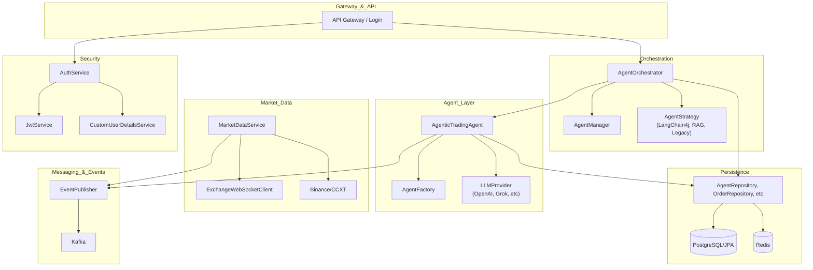

# System Architecture Overview

## Mermaid Diagram

## Component Breakdown

- **Gateway & API**
  - API Gateway / Login: Entry point for user authentication and API requests.

- **Orchestration**
  - AgentOrchestrator: Coordinates agent lifecycle and event dispatch.
  - AgentManager: Manages agent instances and state.
  - AgentStrategy: Pluggable strategies (LangChain4j, RAG, Legacy).

- **Agent Layer**
  - AgenticTradingAgent: Core trading logic and decision-making.
  - AgentFactory: Creates agent instances.
  - LLMProvider: Integrates with LLMs (OpenAI, Grok, etc).

- **Messaging & Events**
  - EventPublisher: Publishes events to Kafka and internal listeners.
  - Kafka: Message broker for event-driven processing.

- **Market Data**
  - MarketDataService: Fetches and processes live market data.
  - ExchangeWebSocketClient: Real-time data from exchanges.
  - Binance/CCXT: External exchange integration.

- **Persistence**
  - AgentRepository, OrderRepository, etc: Data access layers.
  - PostgreSQL/JPA: Main relational database.
  - Redis: Caching and fast data access.

- **Security**
  - AuthService: Handles authentication logic.
  - JwtService: Issues and validates JWT tokens.
  - CustomUserDetailsService: User details for Spring Security.
